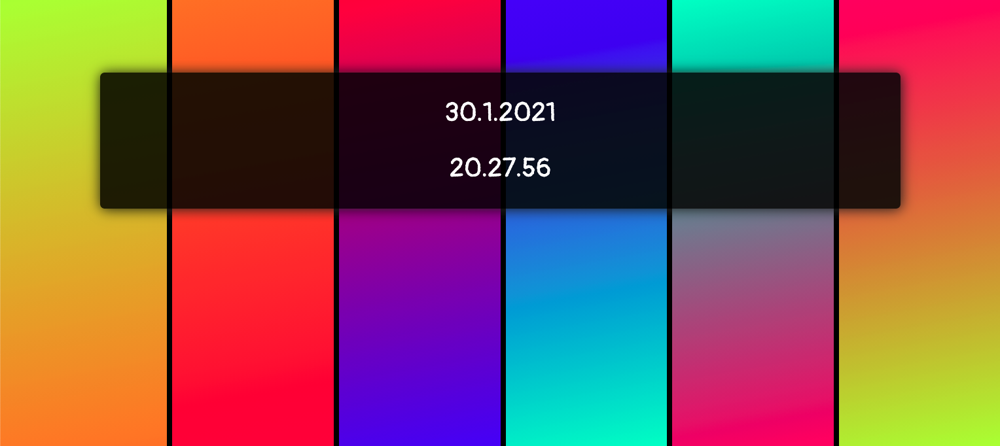
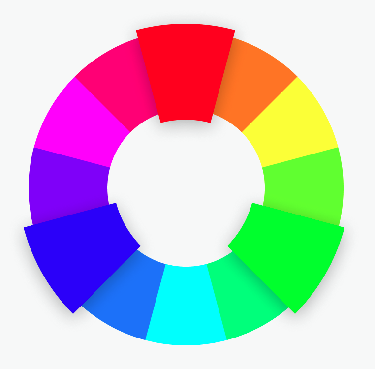
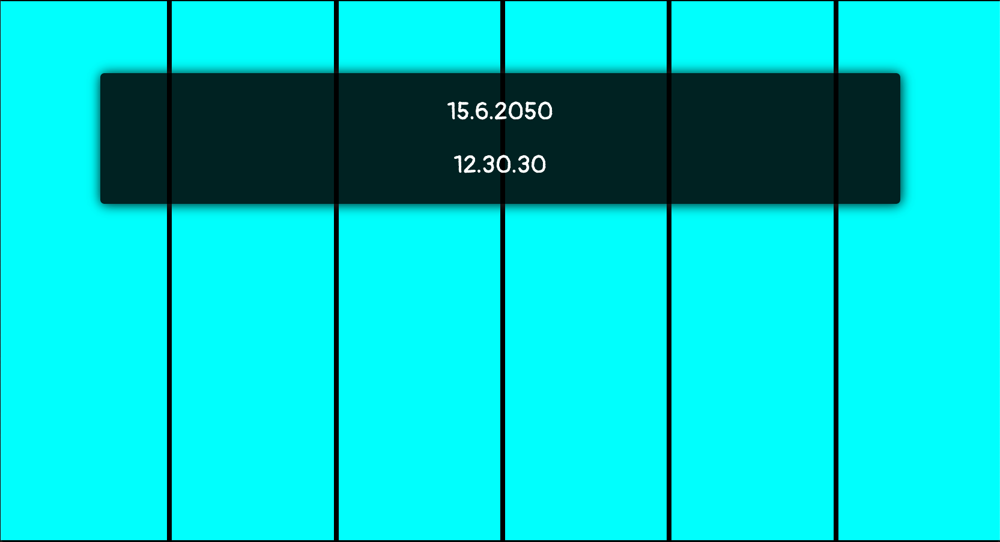
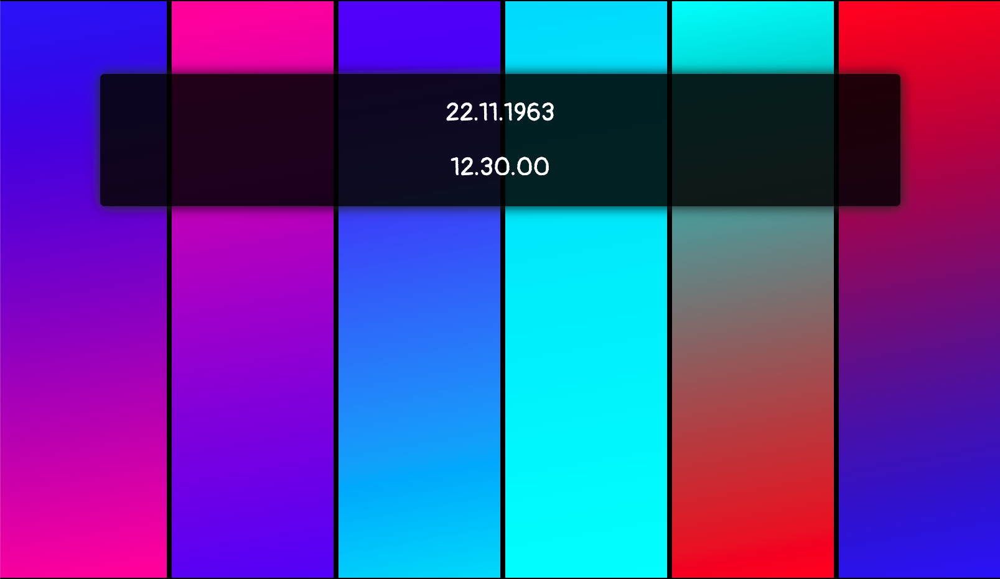
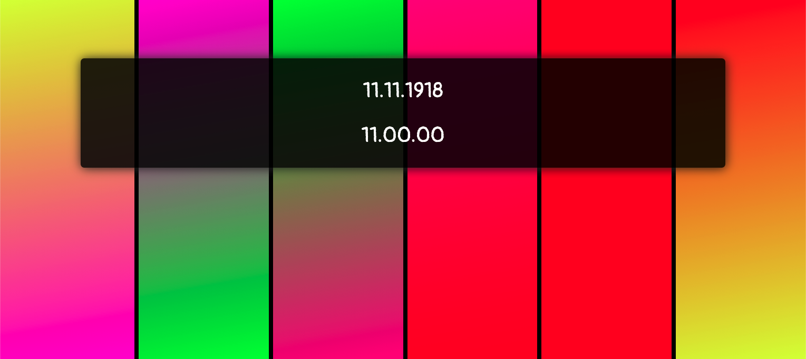

# A colourful clock

See the clock in action at [sermoa.github.io/clock](https://sermoa.github.io/clock/)

This clock changes colours based on the current date and time. For no reason other than to look pretty! With every second that ticks by, the clock produces a unique wall of colour that will not be repeated again for a century.

## What exactly does it do?

There are 6 bars, representing years, months, days, hours, minutes and seconds. The colour at the top of each bar represents how far through we are. For example, the year 2021 is 21% of the way through the century. 21% turns out to be a yellowy-green.

To get a nice gradient effect, the years bar merges into the months colour. The months bar merges into the days colour, and so on. The seconds bar merges back into the years colour.

There is no real reason for this; it was chosen quite arbitrarily just because it creates some nice effects.

## What exactly do the colours mean?

The colours map to a fully saturated colour wheel of hues of light, where 0 and 100 both mean red (`#FF0000`), 33% is green (`#00FF00`) and 66% is blue (`#0000FF`).

The opposite of red in this colour wheel is cyan (`#00FFFF`) which is what we see at 50%.

This means that at precisely 12:30:30 on the 15th June 2050 all the bars will be coloured exactly the same colour - cyan.

## How does it know the date and time?

The date and time are localised to you, and are taken from your device. All the calculations are done locally on your device, which is why you won't see the same time as someone else in a different timezone.

## Why does it display the date and time differently?

The date and time are displayed on the screen in your preferred format according to your device. For me in Denmark, I see the date and time like this:

    30.1.2021 20.27.56

Someone in the UK would likely see the same date and time displayed like this:

    30/01/2021 20:27:56

Whilst someone in the USA would probably see it like this:

    1/30/2021 8:27:56 PM

This is simply using the preferred settings of your device.

## Can I set the clock to a specific date and time?

Yes, you can, with an override parameter in the format

    ?d=YYYY-MM-DD@HH:MM:SS

For example, the moment of the assassination of John F. Kennedy - 22nd November 1963 @ 12:30 PM - is found at the following URL:

[sermoa.github.io/clock/?d=1963-11-22@12:30:00](https://sermoa.github.io/clock/?d=1963-11-22@12:30:00)

Another famous date is the Armistice agreement marking the end of the First World War - the 11th hour of the 11th day of the 11th month, 1918. This can be seen at the following URL:

[sermoa.github.io/clock/?d=1918-11-11@11:00:00](https://sermoa.github.io/clock/?d=1918-11-11@11:00:00)

If you see "Invalid Date" and white bars, it probably means you got the format wrong. Check and try again.

## Can I copy this?

Sure, take it, do what you want with it. It's free, open source, MIT Licensed. I offer no support and make no promises about its quality; it is just something I threw together for fun in a couple of hours. If you make changes, feel free to send me a pull request.

## Credits

- Huge thanks to [Thomas Preece](https://github.com/tepreece) for making the colours change smoothly!
- Also a massive thank you to [Thomas Preece](https://github.com/tepreece) for the brilliant techniqe of a dynamically updating favicon!
